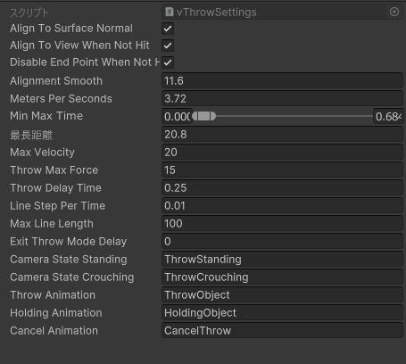

# 投擲物作成と軌道計算

- 投擲物にするオブジェクトにコンポーネントをアタッチする
  - **VThrowableObject**
  - **Rigidbody**
    - isKinematic = true
    - まっすぐ飛ばす場合はConstraints > Position > Y を固定する
  - **Collider**
    - TriggerをONでも可能
  - **VSimpleTrigger**
    - Tags to Detect / Layers to Detectを設定する
- レイヤーをTriggersへ変更する
- VThrowableObject > OnThrowにイベントを設定する
  - Collider.enabled = true
  - vSimpleTrigger.enabled = true
- VSimpleTrigger > OnTriggerEnterにイベントを設定する
  - (爆発エフェクト).gameobject.SetActive(true)
    - エフェクトはRemoveParentで離脱するようにしておく

- 各グレネードの参考
  - 場所: Inventor-3rdPersonController > Shooter > Scripts > ThrowSystem > Prefabs > Grenades

## 投擲物の軌道計算サンプル

``` csharp
public void Launch()
{
  // 秒速
  float metersPerSeconds = 3.72f;
  // 目標地点と発射地点の距離をベクトルで取得
  Vector3 distance = hitPoint - (thrower.transform.position);
  Vector3 distanceXZ = distance;
  // 目標までの高さ
  float height = distance.y;
  // x/y/zのベクトルの長さの合計を出す
  float totalDistance = distance.magnitude;
  // 目標到達までの時間（0.684f部分を変更することで弾道が変化する）
  float time = Mathf.Clamp(distance.magnitude / metersPerSeconds, 0f, 0.684f);
  float Vxz = totalDistance / time;
  float Vy = height / time + 0.5f * Mathf.Abs(Physics.gravity.y) * time;

  Vector3 result = distanceXZ.normalized;
  result *= Vxz;
  result.y = Vy;

  rb.transform.position = thrower.position;
  rb.isKinematic = false;
  rb.velocity = result.normalized * Mathf.Min(MaxVelocity, result.magnitude);
}
```

## 投擲軌道の修正

- 軌道を水平に近づける場合
  - ThrowSettings@Default > Min Max Timeの最大値を小さくする
- 軌道を大きくする場合
  - ThrowSettings@Default > Min Max Timeの最大値を大きくする



MinMaxTimeは放物線計算時の時間である。

この時間を大きくすると滞空時間が増加＝滞空時間が長くなるように放物線が高くなる。

小さくすると滞空時間は減少＝滞空時間が短くなるように放物線が低くなる。