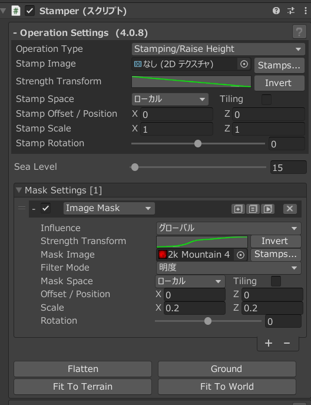
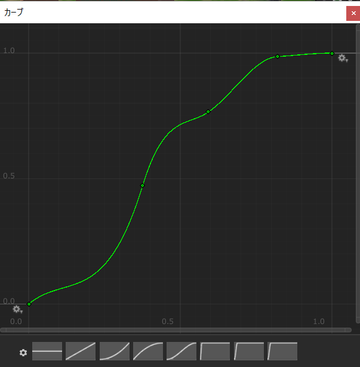

# GAIA

## 地形デザインの手順

- マップ構成を考える。
  - 参考ツール: [Perilous Shores](https://watabou.itch.io/perilous-shores)
    - 地形上で右クリックすることで街などを追加可能。
  - [Perilous Shoresのタグ一覧表](#perilous-shoresのタグ一覧表)も参照。
- Terrainを作成する。
- Stamperを高地用の値に調整する。
  - Stamp ImageをHillsやMountain、Mesasに変更。
  - Strength Transformの調整。
  - ScaleやOffset調整。
- スタンプは複数組み合わせるといい。
- 山→丘→平地というような地形のつながりを意識しておく。
- Baseを描画しないようにする方法
  - Advanced > Appearance / Gizmos / Toolsの設定を調整する。
    - Base levelを変更すると描画するスタンプの高さが変更される。
    - Stamp baseをオフにする。
    - Adaptive baseをオンにする。（地形にブレンドするようになる）
  - スタンプのDistance maskを有効にし、InfluenceをGlobalに変更する。
- スタンプは使いまわし、高さやScaleなどを変化させると早い。
- https://canopy.procedural-worlds.com/library/tools/gaia-pro-2021/written-articles/creating_your_world/3-how-to-mix-and-blend-stamps-on-an-existing-terrain-r47/
- Stone Coverの部分は草テクスチャに変換する。
  - 草に変換することでよりオープンワールドのゲーム風になる。

### Perilous Shoresのタグ一覧表

- 地形

  |タグ名|説明|
  |---|---|
  |archipelago|複数の小さな島|
  |island|島または小さな群島|
  |bay|湾か入江|
  |coast|沿岸地域|
  |fjord|フィヨルド|
  |lake|土に囲まれた水域|
  |land|内陸地域|
  |peninsula|半島、岬、または地峡|

- バイオーム

  |タグ名|説明|
  |---|---|
  |barren|川や沼地や森 ↓ 砂漠 ↑ 居住地 ↓|
  |wetland|川や沼地 ↑ 森林 ↓ 砂漠 無し|
  |woodland|森林 ↑ 砂漠 ↓|

- 山岳

  |タグ名|説明|
  |---|---|
  |highland|山は高く、数も多い|
  |lowland|山は低く、数も少ない|

- 危険度

  |タグ名|説明|
  |---|---|
  |perilous|より多くの危険があり、町や都市はより守られている|
  |safe|危険はなく、町や都市はあまり守られていない|

- その他のオプション（重複可）

  |タグ名|説明|
  |---|---|
  |civilized|より多くの居住地を生成|
  |difficult|山や森や沼地をより多く生成|

- 地名など
  - chaotic
    - ほとんどの地形名はその混沌とした性質を示唆しており、海岸線はよりギザギザしている。
  - evil
    - ほとんどの特徴的な名前は、その邪悪な性質を暗示している。
  - good
    - ほとんどの特徴的な名前は、彼らの善良な性格を暗示している。
  - lawful
    - ほとんどの地形名はその法則性を暗示し、海岸線はより滑らかである。
  - neutral
    - ほとんどの特徴的な名前は、その中立的な性質を示唆している。

### OnePage Dungeonのタグ一覧表

|タグ名|説明|
|---|---|
|backdoor|裏口を生成|
|no backdoor|裏口を生成しない|
|colonnades|列柱をより多く生成|
|compact|廊下なし|
|winding|より多くの廊下を生成する|
|cramped|部屋のサイズを小さくする|
|spacious|大きな部屋をより多く生成する|
|crumbling|瓦礫や亀裂を多く生成する|
|dangerous|死体を表示する|
|deep|階段を多くする|
|flat|階段を生成しない|
|dry|水場を生成しない|
|flooded|水場を多くする|
|wet|水場をいくつか生成する|
|large|最大サイズ|
|medium|標準サイズ|
|small|小さめのサイズ|
|secret|隠し部屋を増やす|
|no secrets|隠し部屋を生成しない|
|ordered|左右対称の構造を増やす|
|chaotic|左右対称にしない|
|round|円形の部屋を増やす|
|square|円形の部屋を生成しない|
|single-level|下り階段を生成しない|
|multi-level|最後の部屋に下り階段を生成し、ほかのマップにつながるようにする|
|string|分岐がなく、一連の部屋にする|
|temple|祭壇をいくつか生成する|
|tomb|棺を生成し、噴水を減らす|
|tresure|宝を生成する|
|dwelling|最後の部屋に玉座を生成し、井戸とタペストリーを生成する|

## Gaiaの注意点

### PostProcessセットアップ

- MainCamera
  - **PostProcess**にチェック
  - 環境 > **ボリュームマスク**を**PostProcess**に変更
- Global Post Processing
  - レイヤーを**PostProcess**へ変更
- UnderWater Post Processing
  - レイヤーを**PostProcess**へ変更

## レベルデザイン TIPS

### スタンプの境界線をなくす方法

- StamperにImage Maskを追加する
  - Influenceをグローバルに変更
  - Imageにスタンプと同じテクスチャを選択する

  

- 斜面の角度等を変更したい場合は Image Mask > Strength Transformのカーブを編集する

### 高地を作成する

- Stamper > Image Mask > Strength Transformのカーブを編集する

  

## 草原の表現

- global spawn density: 0.8
- ProtoType / Prefab
  - width min max: 1.5
  - height min max: 1.5
  - noise spread: 3
- Spawing
  - Detail Density: 40
  - Min Fitness %: 50
  - Fadeout Fitness %: 60

## スタンプ

- 初期の大きさ
  - x: 100 y: 5 z:100
