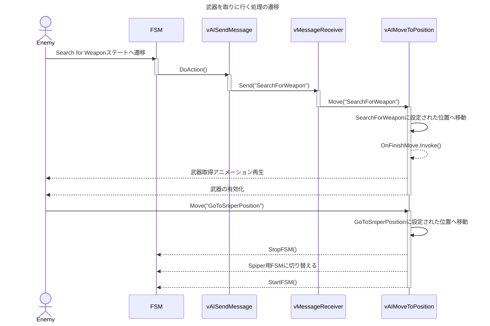

# ステートの追加

- DecisionとActionのスクリプトを作成
- Anyステートから伸びるステートの場合、既存のステートにも新しいDecisionを追加しておく
- アニメーションを実装する場合は`anim.CrossFade()`を利用する
  - Playだと正常に実行されない

## Actionの追加（メッセンジャー利用）

- **AIFSM**ウィンドウで**Action > Controller > Send Message**を選択

    |設定項目|値|
    |---|---|
    |Execution Type|OnStateEnter|
    |Listener Name|任意|
    |Message|引数を渡したい場合は追加|

- AIに`vMessageReceiver.cs`追加
  - **Message Listeners**に以下を追加

    |設定項目|値|
    |---|---|
    |Name|上記で追加したListener Name|
    |OnReceiveMessage|実行したいメソッド|

- スクリプトで任意のタイミングでメッセージを送りたい場合
  - `fsmBehaviour.messageReceiver.Send("Listener Name")`

## 参考にできるFSM

- ダメージを受けたらアクションを起こしたい
  - FSM_CivilianToShooterを参照

- 武器を取りに行く
  - FSM_CivilianToShooterを参照
  - vAISendMessage→vMessageReceiver→vAIMoveToPosition.Move()
  - vFSMChangeBehaviourでCivilianToShooter→ShooterSniperへ変更

