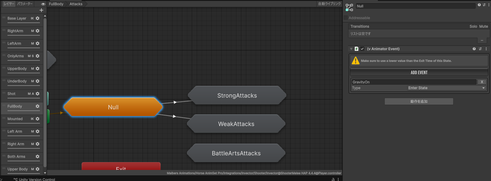
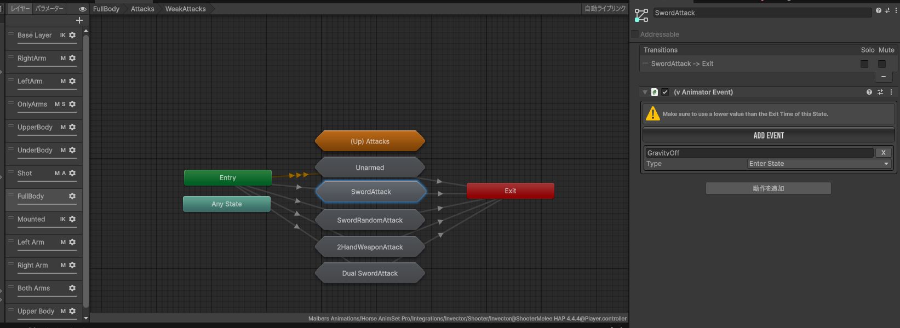

# 空中攻撃の実装

1. 空中でも攻撃できるように入力を変更する。

    ```csharp [vMeleeCombatInput.cs]
    protected virtual bool MeleeAttackConditions()
    {
        if (meleeManager == null)
        {
            meleeManager = GetComponent<vMeleeManager>();
        }
        // 追加
        if (!cc.isGrounded)
            return meleeManager != null && !cc.customAction && !cc.isCrouching && !cc.isRolling && !isEquipping && !animator.IsInTransition(cc.baseLayer);

        return meleeManager != null && cc.isGrounded && !cc.customAction && !cc.isJumping && !cc.isCrouching && !cc.isRolling && !isEquipping && !animator.IsInTransition(cc.baseLayer);
    }
    ```

2. プレイヤーに`vAnimatorEventReceiver`を取り付け、イベントを設定する。

    |項番|設定|値|
    |---|---|---|
    |1|Event Name|GravityOff|
    ||On Trigger Event|vThirdPersonController.DisableGravityAndCollision|
    |2|Event Name|GravityOn|
    ||On Trigger Event|vThirdPersonController.EnableGravityAndCollision|

3. プレイヤーの**Animator > Fullbody > Null**に`vAnimatorEvent`を追加し、以下を設定する。
    - イベント名：GravityOn
    - Type: EnterState
    
4. 空中攻撃用のステートに`vAnimatorEvent`を追加し、以下を設定す
    - イベント名：GravityOff
    - Type: EnterState
    
5. ジャンプ後に攻撃を行い、滞空できるか確認する。