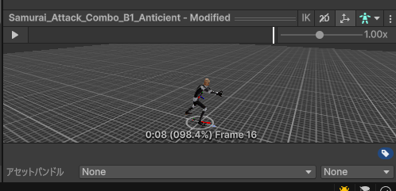
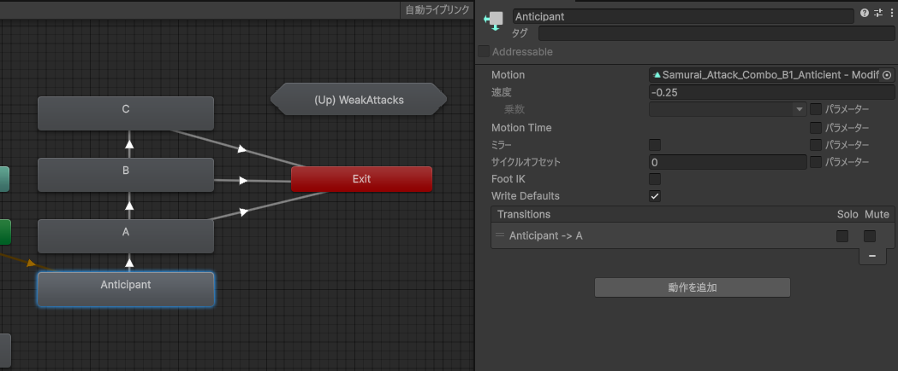
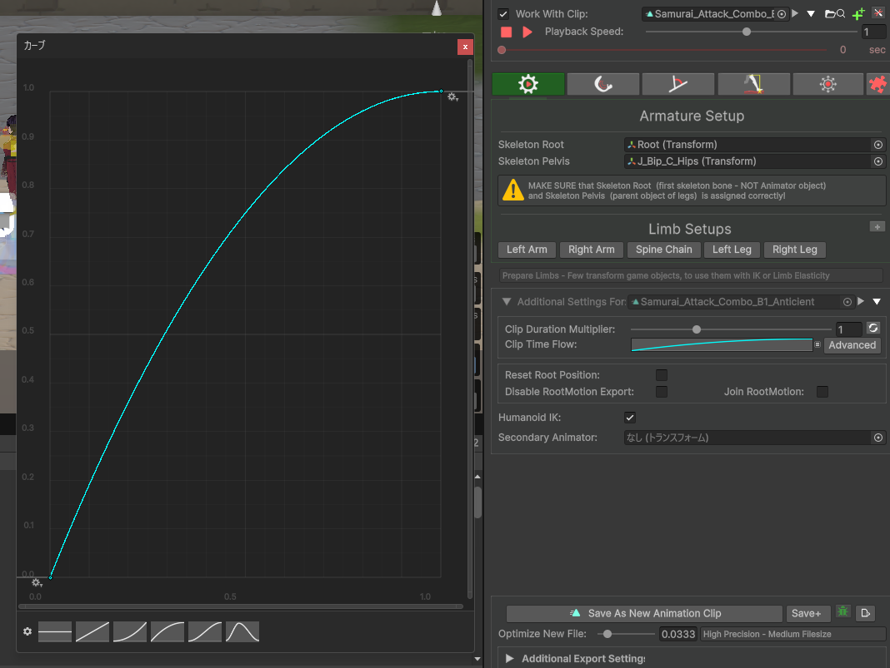

# 予備動作の実装

剣を振りかぶるアニメーション例

1. 予備動作アニメーションを準備する。
    1. 攻撃アニメーションを複製し、振りかぶる部分のみ再生するようにフレームを削除・調整する。
        
2. 攻撃用ステートの前に予備動作ステートを追加し、作成した予備動作アニメーションを設定する。
    
3. 予備動作ステート > 速度を負の値に設定し、逆再生されるようにしておく。

4. 作成した予備動作について、Animation Designerでアニメーションを調整する。

    - Clip Time Flowの線を調整し、**最初は速く、後半は遅く**なるように速度を調整すると動作が認識しやすい。
      
    - 必要に応じてClip Duration Multipilerを延長する。