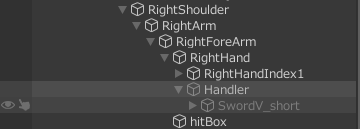

# AIのセットアップ

## Shooter AIの設定

1. AIにラグドールを設定する。

2. AIオブジェクト > AI Shooter Controllerで以下の設定を行う。

    |タブ|設定項目|値|
    |---|---|---|
    |Detection|Min Distance To Detect|3|
    ||Max Distance To Detect|50|
    ||Lost Target Distance|25|
    ||Detect Layer|Player, Enemy, CompanionAI|
    ||Detect Tags|Player, CompanionAI|
    ||Obstacies|Default, BlockAIRayCast|
    |Combat Settings|Attack Distance|50|
    ||Min Distance Of The Target|6|
    ||Combat Distance|10|
    |Shooter Settings|任意で調整||
    
3. VAIShooterManagerの設定を行う。
   1. Aim > DamageLayer: Default, BodyPart
4. レイヤーの設定を行う。
   1. ルートオブジェクト：Tag > Enemy, Layer > Enemy
   2. ボーン（V Damage Receiverがある）部分：Tag > UnTagged, Layer > BodyPart
5. プレイヤー側にダメージ設定を行う。
   1. ルートオブジェクト：Tag > Player, Layer > Player
   2. ボーン（V Damage Receiverがある）部分：Tag > Player, Layer > BodyPart

## 各パラメータの設定

- Nav Mesh Agent

  |設定項目|値|
  |---|---|
  |角速度|200～1000|
  |加速度|50|
  |停止距離|0.1|

- Movement
  - Free Speed / Strafe Speed
    - すべて 1
- Agent

  |設定項目|値|
  |---|---|
  |Acceleration|50|
  |Stoping Distance|0.1|
  |Walking|0|
  |Running|0.05|
  |Sprinting|0.1|

- Detection

  |設定項目|値|
  |---|---|
  |Find Other Target|true|
  |Max Targets Detection|10|
  |Change Target Delay|2|
  |Field Of View|130|
  |Min Distance To Detect|3|
  |Max|20|
  |Lost Target Distance|6|
  |Time To Lost Without Sight|5|

- Combat Settings

  |設定項目|値|
  |---|---|
  |Min Attack Time|0.5|
  |Max|3|
  |Attack Distance|武器の長さ＋腕の長さを合わせた値を参考にする|
  |Min Stay Blocking Time|1|
  |Max|3|
  |Min Distance Of The Target|0.1~0.3|
  |Combat Distance|2.5~4|

## NavmeshAgent / CapsuleCollider

- サイズをキャラクターに合うように調整する。

## Root Motionの修正

攻撃アニメーションにRoot付きのものを利用すると
AIが攻撃時に対象に吸い寄せられる現象が発生するため、
RootMotionの上書きを無効にする。
 

- **vControlAI** > OnAnimatorMoveで呼び出している**base.OnAnimatorMove**をコメントアウトする
- または攻撃アニメーションにInplaceのものを利用する

### 武器の設定

- RightHandにSimpleHolderを作成し、武器を配置する

  

- 任意の場所に納刀状態の武器を取り付ける

- キャラに**vSimpleHolder**を取り付ける
  - Events > On Enable Weapon: **作成したSimpleHolder.SetActive(false)** を設定
  - Events > On Disable Weapon: **作成したSimpleHolder.SetActive(true)** を設定
  - Weapon Object: 納刀状態の武器オブジェクト
- キャラに **vMessageReceiver** を取り付ける
  - Message Listenersに以下を設定

    |リスナー名|On Receive Messageの設定|
    |---|---|
    |EnableWeapon|vSimpleHolder.EquipWeapon|
    |DisableWeapon|vSimpleHolder.UnequipWeapon|

- FSM > Chaseステートなどのアクションに以下を設定

  |アクション名|スクリプト|パラメータ|
  |---|---|---|
  |EnableWeapon|vAISendMessage|EnableWeapon|
  |DisableWeapon|vAISendMessage|DisableWeapon|

## 攻撃モーションとリアクション

- 攻撃モーション中にリアクションを割り込ませる設定
  - 攻撃モーションのトランジション > 中断要因を「Next State」に変更する
    - Null→〇〇AttacksのトランジションとA→Bのようなトランジションへ設定する
  - Big hit reactionのAnyState→各ステートのトランジション > 中断要因を「Current State」へ変更する
  - Bit hit reactionのExitへ伸びるトランジション > 中断要因を「Next State」へ変更する
- 攻撃後に若干時間を空けてあげると、AIが連続的に攻撃することを防げる
