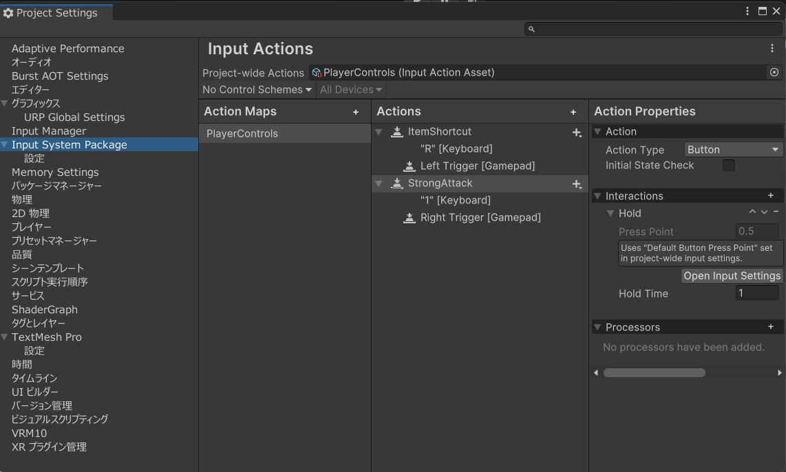

# 長押し処理・同時押し処理

## Input systemを使った長押し処理

長押し可能なInputActionを作成する。
↓StrongAttackを選択し、インタラクション > Holdを追加する。


## チャージ方式の強攻撃

`strongAttackRef`に強攻撃用のInputActionを設定する。

```cs [vShooterMeleeInput.cs]
[SerializeField]
protected InputActionReference strongAttackRef;
protected bool isChargeComplete = false;
public UnityAction OnCharged;

/// <summary>
/// 強攻撃入力時のイベントを登録する
/// </summary>
protected void RegistStrongAttackEvent()
{
    // 押し始め
    strongAttackRef.action.started += (context) =>
    {
        if ((!meleeManager.CurrentActiveAttackWeapon || meleeManager.CurrentActiveAttackWeapon.useStrongAttack)
            && MeleeAttackStaminaConditions())
        {
            isChargeComplete = false;
            TriggerStrongAttack();
        }
    };

    // 規定時間まで押した場合
    strongAttackRef.action.performed += (context) =>
    {
        isChargeComplete = true;
        OnCharged?.Invoke();
    };

    // ボタンを離した場合
    strongAttackRef.action.canceled += (context) =>
    {
        TriggerStrongAttack(isChargeComplete ? "ChargeAttack" : "QuickAttack");
        isChargeComplete = false;
    };
}
```