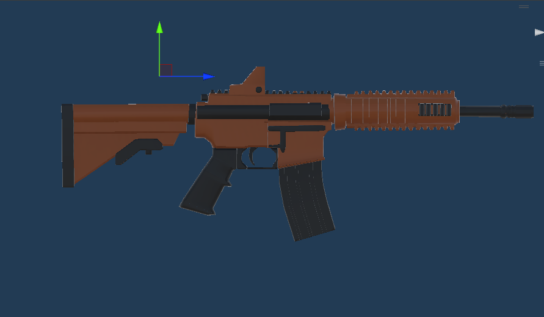
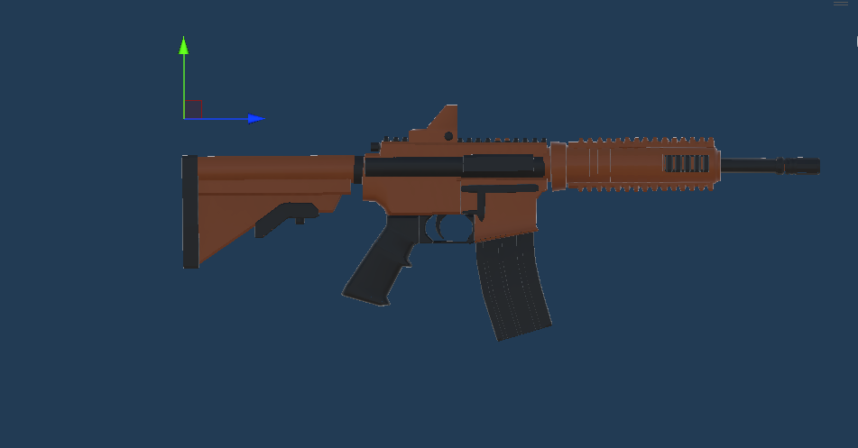
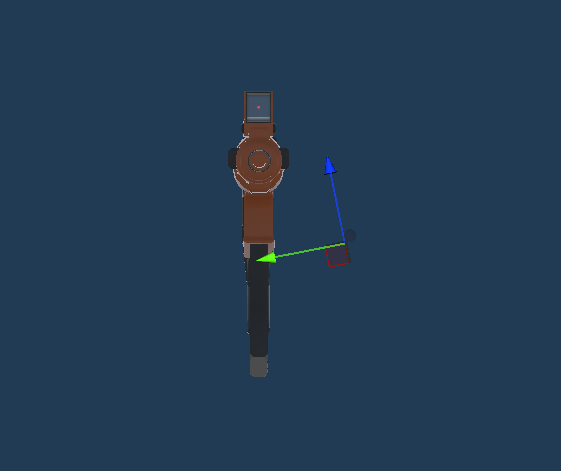
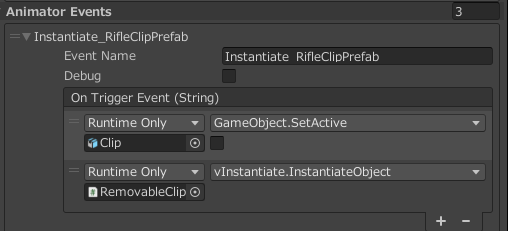
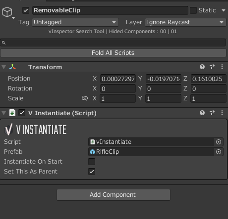
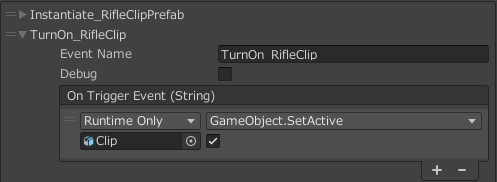
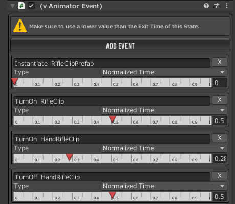

# 武器の設定

- [ID設定](#id設定)
- [スナイパースコープの設定例](#スナイパースコープの設定例)
- [IK設定](#ik設定)
- [エイムカメラ](#エイムカメラ)
- [武器の設定](#武器の設定-1)
- [エフェクト](#エフェクト)
- [弾丸の編集](#弾丸の編集)
- [リロード](#リロード)
- [ショットガンの実装](#ショットガンの実装)
- [ヘッドショット判定](#ヘッドショット判定)


## ID設定

**VShooterWeapon > WeaponID**を設定する
レティクルの変更は**ScopeView > Scope ID**を変更する
レティクルのIDは**AimCanvas**配下を参照する

|カテゴリ|Moveset ID|UpperBody ID|Shot ID|Reload ID|Equip ID|Scope ID|
|---    |---       |---         |---    |---      |---      |---    |
|ハンドガン|1       |1           |-1    |1        |5        |1       |
|ライフル|1         |2           |2      |2        |0        |2      |
|ショットガン|1     |3            |3      |3        |0       |4       |
|スナイパー|1       |2            |4      |2        |0       |0       |


- スナイパー
  - スナイパースコープの設定も参照
  - Use UIをtrueにする

## スナイパースコープの設定例

- スコープ用カメラを設置する
  - 銃身が映らないように設置する
  - Projection > Clipping > Clipping Planesを**0.3/250**に変更する
  - Output > Output Textureに**aimCameraRenderer**を設定する
- V Shooter Weapon > Scope View
  - Use UI: true
  - Scope Zoom: 45
  - Custom Scope Camera State: ScopeAiming
  - Zoom Scope Camera: スコープ用カメラ
- スコープ用UIの編集は以下を参照する
  - Aim Canvas > AimID_0_Sniper
    - Scope Aim Groupe


## IK設定

- Invector > Shooter > IK Adjust Windowを開く
- Unityを再生し、プレイヤーに武器を装備させる
- 「Hand IK Target」を選択する
  - 右手・左手の球体を選択し、適切な位置になるように変更する
  - ここで設定した内容はしゃがみやエイム時などの状態に引き継がれる
- Adjustの設定は以下の4つを設定する
  - 非エイム時・立ち/しゃがみ
  - エイム時・立ち/しゃがみ
- IK Adjustの設定は武器カテゴリごとに設定する
  - カテゴリの設定は武器 > Weapon Settings > Weapon Category
- 武器ごとにLeftHandIKの位置を調整する

## エイムカメラ

- vThirdPersonCameraのAiming設定を変更する

## 武器の設定

- モデルはrenderer配下に格納し、座標を0にする
- ScopeTarget

  

- AimReference

  

- Lefthand IK

  

## エフェクト

- マズルフラッシュ
  - renderer配下にParticlesオブジェクト作成
  - Particles配下にマズルフラッシュのパーティクル配置
    - Play on awakeをオフにする
  - V Shooter Weapon > Audio & VFX > Emitt Shuryken Particleにパーティクルをセットする
- 射撃音
  - V Shooter Weapon > Audio & VFX > Fire Clip / EmptyClipを設定する
  - 【参考】gamemaster audioの射撃音
    - gun_xxx_auto_shot_01 - 08…射撃音に使う（ランダム再生で利用）
    - gun_xxx_auto_shot_00…1発目の音に使う
  - ランダム化
    - vShooterWeaponBaseに変数`fireClips: AudioClip[]`を用意する
    - vShooterWeaponBase > ShotEffect()のif文を以下のように変更する

      ``` csharp
      if (source && fireClip)
      {

          //source.PlayOneShot(fireClip);
          int rand = Random.Range(0, fireClips.Length);
          source.PlayOneShot(fireClips[rand]);
      }
      ```

## 弾丸の編集

- vDefaultBullet
  - trail > Trail RendererのColorを任意の色に変更し、透明度を255に統一する。
  - trail > Trail Rendererの時間を減らす。（0.025など）
  - trailマテリアルの色を変更する。

## リロード

- 武器にvAnimatorEventReceiverを取り付ける
- RemovableClipの作成
  - マガジンと同じ階層に空オブジェクト（**RemovableClip**）を作成する。
  - RemovableClipに`VInstantiate`を取り付ける。
    - プレハブ：マガジンのプレハブ
    - Instantiate On Start：Off
    - Set This as Parent：On
- マガジンのプレハブの作成
  - 設定するコンポーネント
    - Box Collider / Rigidbody / VDestroy Game Object / VRemove Parent
- AnimatorEventsの設定を行う
  - マガジンを落とす演出
  
  
  

  - マガジン表示演出

  

  - アニメーションイベント設定

  

## ショットガンの実装

- V Shooter Weapon > Projectileの設定を変更する
  
  |項目|内容|備考|
  |---|---|---|
  |Projectile|vDefaultBullet|-|
  |Projectiles Per Shot|6|一度に何発放出するか|
  |Dispersion|4|拡散範囲|
  |DispersionSharp|Circle|拡散の形|

## ヘッドショット判定

- キャラクターにラグドール設定を行う
  - 各パーツにvDamageReceiverが取り付けられる
- 頭のvDamageReceiver > Damage Multiplerの値を変更する
  - 必要であればOverride Reaction IDを有効にする
- V Shooter Weapon > Layer & Tagに**Default, BodyPart**を設定する