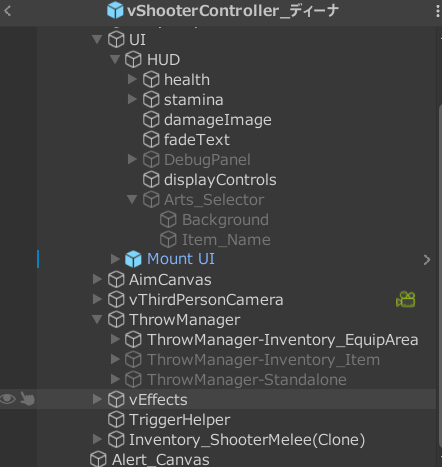
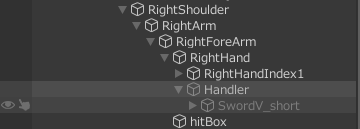

# キャラクターのセットアップ

- [キャラクターのセットアップ](#キャラクターのセットアップ)
  - [プレイヤーの初期設定手順](#プレイヤーの初期設定手順)
    - [キャラクター作成](#キャラクター作成)
    - [乗馬機能の追加](#乗馬機能の追加)
    - [カメラアングルの調整](#カメラアングルの調整)
    - [戦闘拡張スクリプトの設定](#戦闘拡張スクリプトの設定)
    - [戦闘アニメーションの作成](#戦闘アニメーションの作成)
    - [オリジナルアイテムの作成](#オリジナルアイテムの作成)
    - [攻撃エフェクトの実装](#攻撃エフェクトの実装)
  - [カメラの設定](#カメラの設定)
  - [カバーアドオン](#カバーアドオン)
  - [キャラクター自身に機能追加する場合](#キャラクター自身に機能追加する場合)
  - [ThrowManagerの編集](#throwmanagerの編集)
  - [AI](#ai)
    - [各パラメータの設定](#各パラメータの設定)
    - [AIの調整項目](#aiの調整項目)
    - [Root Motionの修正](#root-motionの修正)
    - [武器の設定](#武器の設定)
    - [攻撃モーションとリアクション](#攻撃モーションとリアクション)
  - [ThrowManagerの編集](#throwmanagerの編集-1)

## プレイヤーの初期設定手順

### キャラクター作成

1. キーコンフィグ決定
2. MeleeManagerの設定
   1. hitLayerの設定
   2. recoilをなしにする
3. Handlerの位置を調整する
   1. Righthand / Lefthandと各DefaultHandlerを移動する
4. 足音の編集（defaultSurface）

**HorseAnimsetProを利用予定の場合、以下の手順は省略**

5. ローリングアニメーションと速度の設定
   1. 基本はRootMotionを有効にしておく
   2. <a href="./rolling_cancell#ローリング設定値" target="_blank">ローリング設定</a>を参照する
6. Locomotionアニメーションの設定
   1. FreeLocomotion
   2. StrafeLocomotion

### 乗馬機能の追加

1. [HAPの設定手順](https://malbers-animations.gitbook.io/animal-controller/annex/integrations/invector-templates)に従って、初期設定を行う
2. Invector入力対応スクリプトを作成する
3. Realistic Horse > MalbersInput > Strafeを削除する
4. ローリングアニメーションと速度の設定
   1. 基本はRootMotionを有効にしておく
   2. <a href="./rolling_cancell#ローリング設定値" target="_blank">ローリング設定</a>を参照する
5. Locomotionアニメーションの設定
   1. FreeLocomotion
   2. StrafeLocomotion
6. 足音の編集（defaultSteps）とHorse > Effectsの変更

### カメラアングルの調整

1. vThirdPersonCameraのLockOn・Defaultのアングルを調整
   1. [参考 - カメラの設定](#カメラの設定)

### 戦闘拡張スクリプトの設定

<a href="https://github.com/Iroha71/unity-scripts/tree/main/BattleDirection">戦闘拡張スクリプト</a>をプレイヤーの子要素に配置する

### 戦闘アニメーションの作成

1. 以下のアニメーションを編集する
   1. FreeLocomotion
   2. StrafeLocomotion
   3. WeakAttacks
   4. StrongAttacks
   5. Defense
   6. Recoil
   7. Big Hit Reaction
2. Invectorのデフォルトアイテムリストを使用した状態で、武器を装備し、アニメーションを確認する

### オリジナルアイテムの作成

1. アイテムリストを作成し、ItemManagerに設定する
2. アイテムに武器や回復アイテムを作成する

### 攻撃エフェクトの実装

1. <a href="https://github.com/Iroha71/unity-scripts/tree/main/AttackEffectAttacher">攻撃エフェクト設定ツール</a>を導入する。
2. 各武器モーションのエフェクトを設定する。

## カメラの設定

- Default

    |項目|値|
    |---|---|
    |Right|0|
    |Distance|4|
    |Height|1.81|
    |Rotation Offset|(0, 0, 0)|

- LockOn

    |項目|値|
    |---|---|
    |Right|0.2|
    |Distance|3.5|
    |Height|2|
    |Rotation Offset|(7, 0, 0)|

## カバーアドオン

- Invector > Cover Add-On > Create Cover Controllerでキャラクターを作成する
- UIの変更（任意）
  - キャラクター > Cover UI Prefabを編集する
- NavMeshを導入し、床にBakeする
- カバーラインの作成
  - Invector > Cover Add-On > Create New Cover Lineでカバーラインを作成する
  - 赤点をクリックするとカバーラインの長さを変更できる
  - カバーラインを直角に曲げる方法
    - カバーライン > New Cover Pointで新しいポイントを作成する
    - カメラを俯瞰に移動し、赤点をドラッグして直角に移動させる
    - コンポーネント内の設定を変更することで、厚さや幅を調整可能。
- 必要に応じてカバーオブジェクトにNavMeshObstaclesをアタッチする
  - オブジェクトが移動しても、Bakeしなおす必要がなくなる
- V Cover Controller > Cover Settings

  |項目|内容|
  |---|---|
  |Enter/Exit Input|カバーを取るキー設定|
  |Auto Enter Cover|自動カバー|
  |Auto Exit Cover|壁を離れるような入力を受けるとカバーを外す|

## キャラクター自身に機能追加する場合

- interfaceを作成する
- vThirdPersonMotor or vThirdPersonControllerに実装を行う
  - Motor: スタミナ・ローリングなどの動作定義・TakeDamage()の実装が行われている
- vEditorToolBarでインスペクタ上でグリッド表示が行える

## ThrowManagerの編集

- プレイヤー配下のThrowManagerを有効にする

  

  |オブジェクト名|用途|
  |---|---|
  |~-Inventory_EquipArea|投擲物を装備欄に装備するタイプ|
  |~-Inventory_Item|Itemとして管理するが、装備の必要がない|
  |~-Standalone|ItemManagerとは独立して管理|

- vThrowManagerInventory > Throwable > Default Handlerを設定する
  - 場所: RightHand配下に作成

## AI

### 各パラメータの設定

- Nav Mesh Agent

  |設定項目|値|
  |---|---|
  |角速度|200～1000|
  |加速度|50|
  |停止距離|0.1|

- Movement
  - Free Speed / Strafe Speed
    - すべて 1
- Agent

  |設定項目|値|
  |---|---|
  |Acceleration|50|
  |Stoping Distance|0.1|
  |Walking|0|
  |Running|0.05|
  |Sprinting|0.1|

- Detection

  |設定項目|値|
  |---|---|
  |Find Other Target|true|
  |Max Targets Detection|10|
  |Change Target Delay|2|
  |Field Of View|130|
  |Min Distance To Detect|3|
  |Max|20|
  |Lost Target Distance|6|
  |Time To Lost Without Sight|5|

- Combat Settings

  |設定項目|値|
  |---|---|
  |Min Attack Time|0.5|
  |Max|3|
  |Attack Distance|1.25 ~ 1.65|
  |Min Stay Blocking Time|1|
  |Max|3|
  |Min Distance Of The Target|1 ~ 1.4|
  |Combat Distance|2.5~3|

### AIの調整項目

- vControlAI > Movement > StrafeSpeed
  - WalkSpeed
  - RunningSpeed
- vControlAI > Agent
  - Aceleration: 50
  - Stoping Distance: 1
- vControlAI > Combat Settings
  - Attack Distance: 1.25
  - Min Distance Of The Target: 1
  - Combat Distance: 2.5

### Root Motionの修正

攻撃アニメーションにRoot付きのものを利用すると
AIが攻撃時に対象に吸い寄せられる現象が発生するため、
RootMotionの上書きを無効にする。
 

- **vControlAI** > OnAnimatorMoveで呼び出している**base.OnAnimatorMove**をコメントアウトする
- または攻撃アニメーションにInplaceのものを利用する

### 武器の設定

- RightHandにSimpleHolderを作成し、武器を配置する

  

- 任意の場所に納刀状態の武器を取り付ける

- キャラに**vSimpleHolder**を取り付ける
  - Events > On Enable Weapon: **作成したSimpleHolder.SetActive(false)** を設定
  - Events > On Disable Weapon: **作成したSimpleHolder.SetActive(true)** を設定
  - Weapon Object: 納刀状態の武器オブジェクト
- キャラに **vMessageReceiver** を取り付ける
  - Message Listenersに以下を設定

    |リスナー名|On Receive Messageの設定|
    |---|---|
    |EnableWeapon|vSimpleHolder.EquipWeapon|
    |DisableWeapon|vSimpleHolder.UnequipWeapon|

- FSM > Chaseステートなどのアクションに以下を設定

  |アクション名|スクリプト|パラメータ|
  |---|---|---|
  |EnableWeapon|vAISendMessage|EnableWeapon|
  |DisableWeapon|vAISendMessage|DisableWeapon|

### 攻撃モーションとリアクション

- 攻撃モーション中にリアクションを割り込ませる設定
  - 攻撃モーションのトランジション > 中断要因を「Next State」に変更する
    - Null→〇〇AttacksのトランジションとA→Bのようなトランジションへ設定する
  - Big hit reactionのAnyState→各ステートのトランジション > 中断要因を「Current State」へ変更する
  - Bit hit reactionのExitへ伸びるトランジション > 中断要因を「Next State」へ変更する
- 攻撃後に若干時間を空けてあげると、AIが連続的に攻撃することを防げる

## ThrowManagerの編集

- プレイヤー配下のThrowManagerを有効にする

  

  |オブジェクト名|用途|
  |---|---|
  |~-Inventory_EquipArea|投擲物を装備欄に装備するタイプ|
  |~-Inventory_Item|Itemとして管理するが、装備の必要がない|
  |~-Standalone|ItemManagerとは独立して管理|

- vThrowManagerInventory > Throwable > Default Handlerを設定する
  - 場所: RightHand配下に作成
