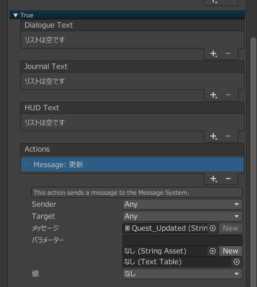

# Qeust Machine

## 目次

- [Qeust Machine](#qeust-machine)
  - [目次](#目次)
  - [セットアップ](#セットアップ)
  - [Journal UIを任意のUIに組み込む](#journal-uiを任意のuiに組み込む)
  - [Dialogue System連携](#dialogue-system連携)
    - [Quest Machine -\> Dialogue Systemへのクエスト共有](#quest-machine---dialogue-systemへのクエスト共有)
  - [クエスト設定方法](#クエスト設定方法)
  - [クエスト発行者の設定](#クエスト発行者の設定)
  - [クエスト状態変更時に任意のイベントを実行する](#クエスト状態変更時に任意のイベントを実行する)
  - [LUAの拡張](#luaの拡張)
  - [外部セーブシステムを使う場合](#外部セーブシステムを使う場合)

## セットアップ

1. QuestMachineプレハブを設置
2. QuestMachine > Quest Databaseをアタッチ
3. プレイヤーへ`QuestJournal`をアタッチ
4. Quest Journal UI へ MessageEventsをアタッチ
5. MessageEvents > Snederへ**PausePlayer / UnPausePlayer**イベントを設定
6. UIPanel > OnOpen: QuestJournalUI.MessageEvents.SendToMessageSystem(0) / OnClose: QuestJournalUI.MessageEvents.SendToMessageSystem(1)

## Journal UIを任意のUIに組み込む

1. QuestMachineプレハブ > QuestMachineConfigration > Hide Journal UI On Startのチェックを解除
2. Quest Journal UIを任意のCanvasへ移動させる
   - Animatorは削除
   - UIPanelのShow Animation Trigger / Hide Animation Triggerの中身を削除
   - Start StateをOpenへ設定
   - Deactivate On Hiddenを解除
3. QuestJournal > Journal UI へ↑のUIを割り当て

- Journalの内容を更新・開く場合はQuestJournal.ShowJournalUI()を呼び出す

## Dialogue System連携

0. Dialogue System Supportをインポート
1. **Dialogue Manager**へ**DialogueSystemQuestMachineBridge**を取り付ける
2. **Quest Machine**へ**DialogueSystemQuestDialogueUI**を取り付ける
3. Dialogue Databaseの項目を設定する

    |項目|値|
    |---|---|
    |Actor|Quest Giverと同じIDを追加する|
    |Quest/Item|Quest Machineと同じIDを追加する|

4. （クエスト着手済みか確認）クエストノード > Conditionへ以下を追加
   1. **CurrentQuestState("Quest ID") == "unassigned"**
5. （クエスト付与）クエストノード > Scriptへ以下を追加
   1. **GIveQuest("Giver", "Quest ID")**
6. （クエストノードの状態確認）クエストノード > Conditionへ以下を追加

    ```lua
    CurrentQuestState("Quest ID") == "active" and
    (GetQuestNodeState("Quest ID", "Node ID")) == "active"
    ```

7. Questへ以下を追加

    |設定項目|設定する値|入力値|
    |---|---|---|
    |Offer > Offer Text|Dialogue System Conversation|クエストが発生する会話|
    |States > Successful|Dialogue System Conversation|クエストが発生する会話|

- DialogueSystemで使えるLuaはQuestMachineのPDFに記載（Lua functions）

### Quest Machine -> Dialogue Systemへのクエスト共有

1. プレイヤー > Dialogue System Bridgeのすべての項目がオンになっていることを確認する
2. Pixel Crushers > Quest Machine > Third Party > Dialogue System > Quest DB To Dialogue DBを実行する
   - Dialogue側にクエスト情報が流し込まれ、Dialogue System上で操作できる

## クエスト設定方法

1. ID / Titleを入力
2. クエスト情報の設定
   1. States > Active

    |項目|設定|備考|
    |---|---|---|
    |Journal Text|Heading|Use Quest TitleをON|
    |HUD Text|Heading|Use Quest TitleをON|

3. ノード毎にアクションを設定
   1. Body Textを設定

      |アクション項目|説明|必須か|
      |---|---|---|
      |Dialogue Text|Quest Machineの依頼ダイアログ表示文|×|
      |Journal Text|Quest Journalの表示文|〇|
      |HUD Text|画面上に表示される|〇|

   2. Condition（ノードを進める条件）の設定
       1. 例）**Messaging Systemを利用するやり方**
       2. ノード > Conditionに**Message**追加
          - Message: 任意の値
          - Parameter: 任意の値
       3. 任意のオブジェトでメッセージを送る
          - 例）QuestControl.SendToMessageSystem("Message:Parameter:Value")
       4. 例）**Luaを利用するやり方**
          - ダイアログノード > Scriptで以下を追加
          - **SetQuestNodeState("Quest ID", "Node ID", "active")**

## クエスト発行者の設定

- 発行者オブジェクト > `QuestGiver`をアタッチ
  - Questsに発行予定クエストを設定

## クエスト状態変更時に任意のイベントを実行する

- 対象クラスに`IMessageHandler`を実装

``` csharp
[SerializeField]
private StringField questActivate;
[SerializeField]
private StringField questUpdated;
[SerializeField]
private StringField questFinished;

void Start()
{
    // MessageSystemに特定のメッセージを登録する
    MessageSystem.AddListener(this, questActivate.value, string.Empty);
    MessageSystem.AddListener(this, questUpdated.value, string.Empty);
    MessageSystem.AddListener(this, questFinished.value, string.Empty);
}

// メッセージが発行された際に呼び出される
public void OnMessage(MessageArgs args)
  {
      Quest quest = QuestMachine.GetQuestAsset(artgs.parameter);
      if (args.message.Equals(questActivate.value))
      {
          DirectActivateQuest(questName: quest.title.value, args.message);
      }
      else if (args.message.Equals(questUpdated.value))
      {
          // クエスト更新時の処理
      }
      else if (args.message.Equals(questFinished.value))
      {
          // クエスト終了時の処理
      }
  }
```

- クエストオブジェクト > State > Actions等でメッセージを設定
  - 画像ではTrueに設定しているが、Activeでも問題ない

    

## LUAの拡張

1. Pixcel Crusher > Dialogue System > Custom Function Lua Infoで作成
2. Script Functionsへ1行追加し、以下を設定
    |項目|値|
    |---|---|
    |Function Name|呼び出したいメソッド名|
    |Parameters|引数の型|
    |Return Value|戻り値|
3. 以下のようなスクリプトを作成する

    ``` csharp [Sample.cs]
      using UnityEngine;
      using PixelCrushers.QuestMachine;
      using PixelCrushers.DialogueSystem;

      public class QuestFromDialogueContainer : MonoBehaviour
      {
          // Start is called before the first frame update
          void Start()
          {
              // 会話終了時にクエスト発行処理を行うイベントを実行
              eventer.conversationEvents.onConversationEnd.AddListener(IgniteQuest);

              // Custom Lua Functionへメソッドを登録
              Lua.RegisterFunction("AddThisQuest", this, SymbolExtensions.GetMethodInfo(() => AddThisQuest(string.Empty)));
          }

          // Queueに詰められたクエストを順次発行する
          public async void IgniteQuest(Transform npc)
          {
              if (tempQuestId.Count <= 0)
                  return;

              await UniTask.Delay(1000);
              QuestMachine.GiveQuestToQuester(tempQuestId[0], "player");
          }

          // 会話中に発生したクエストをQueueに追加する
          public void AddThisQuest(string id)
          {
              tempQuestId.Add(id);
              Debug.Log(tempQuestId[0]);
          }
      }
    ```

## 外部セーブシステムを使う場合

- 【セーブ時】クエスト情報を文字列として取得する

    ``` csharp
    string s = QuestMachine.GetQuestJournal().RecordData();
    ```

- 【ロード時】文字列をクエスト情報として反映する

    ``` csharp
    QuestMachine.GetQuestJournal().ApplyData(s);
    ```

- 参考: [コミュニティ](https://www.pixelcrushers.com/phpbb/viewtopic.php?t=5284)
