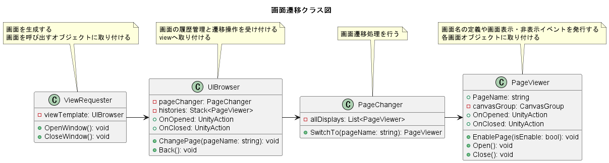
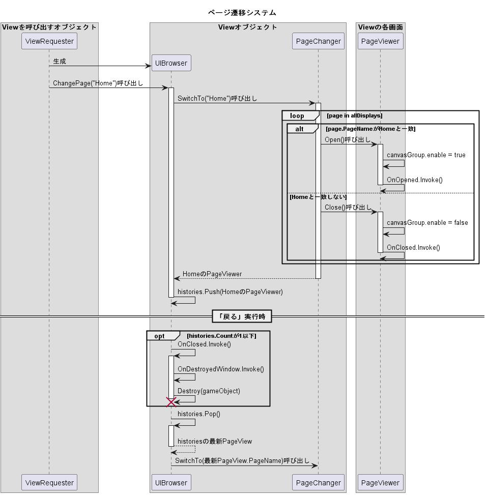
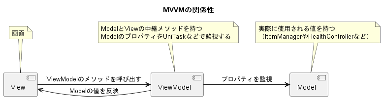
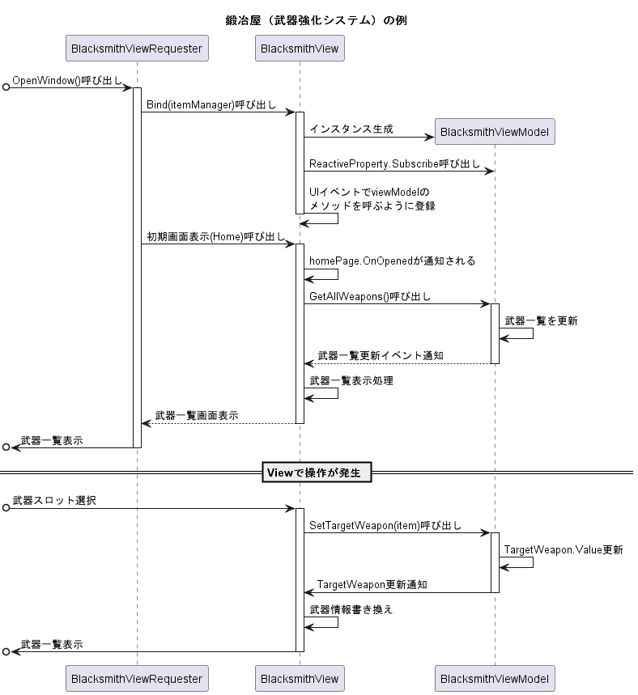

# UIアーキテクチャのまとめ

## 画面遷移

## MVVMモデル

### MVVMを使ったUI例

鍛冶屋（武器強化システム）

## Ultimate Clean GUI

### 通知の実装

- 任意のオブジェクトに`NotificationQueue.cs`を追加
- 通知を出すオブジェクトに`NotificationLauncher.cs`を追加
- `NotificationLauncher.cs` > `LaunchNotification()`を実行
