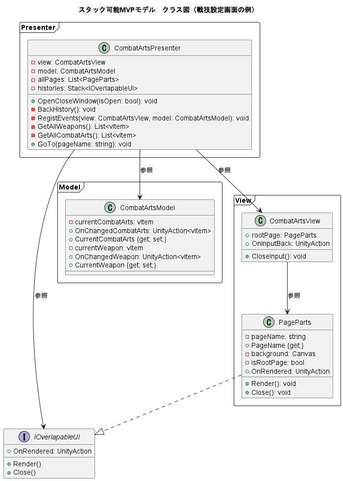
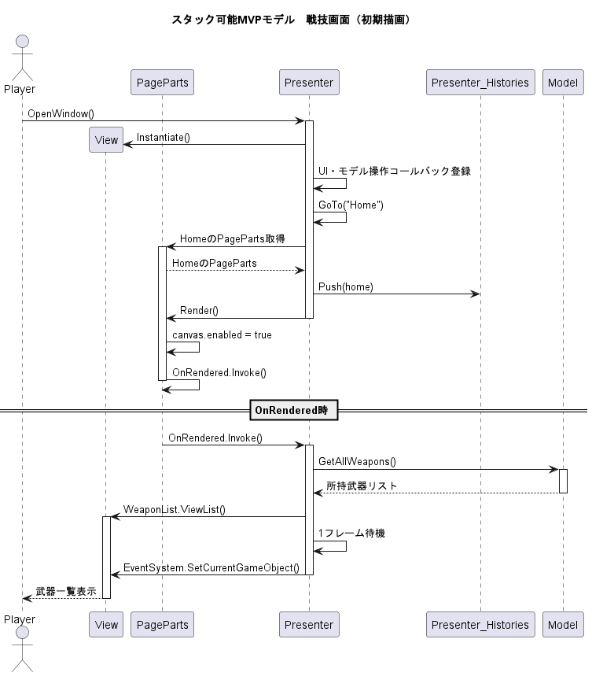
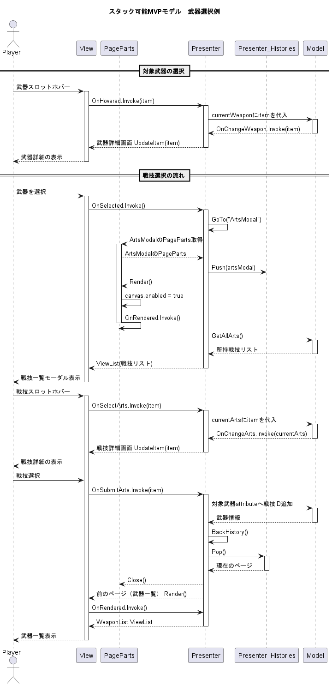

# 役立つ TIPS

## ハイスピードアクションの実装（ニーアなど）

### アニメーション

- 0.5秒以内に収まるようにする
  - 120fpsなら60フレーム以内
  - 1撃目は猶予を持たせ、2撃目以降は予備動作を短くすることで素早いコンボにする
  - 予備動作を短くする
- ニーアオートマタの場合
  - 小型剣の最初のコンボ（切り付け2回）は合計で0.56秒
  - １回の攻撃は約0.3秒で納めるといい

## TIPS

- EventSystem.current.SetCurrentSelectGameObject()をする前に1フレーム待機する
  - 正常に選択されない場合がある

## MVPパターンを適用したスタック可能UI

- [コード例](https://github.com/Iroha71/unity-docs/tree/develop/assets/origin-scripts/UI)

### 画面遷移（戦技設定画面例）

